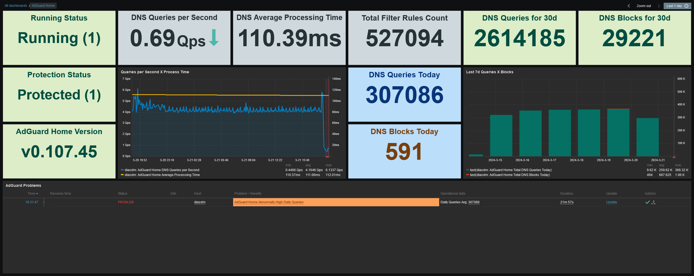

# Zabbix Template for AdGuard Home

<div align="right">

[](./LICENSE)
[](https://github.com/diasdmhub/AdGuard_Home_Zabbix_Template/releases/tag/latest)

</div>

<BR>

### OVERVIEW

[AdGuard Home](https://github.com/AdguardTeam/AdGuardHome) is a network-wide ad blocking and tracking software. Once you've set it up, it will cover your devices without the need for any client-side software.

If you want to monitor your AdGuard Home instance with Zabbix, this template provides some useful monitoring items. \
The monitoring is done via "REST-ish" API as [AdGuard Home offers an OpenAPI specification](https://github.com/AdguardTeam/AdGuardHome/tree/master/openapi).

The main focus is on monitoring statistics from AdGuard Home.

<BR>

---

### ➡️ [Download (latest)](https://github.com/diasdmhub/AdGuard_Home_Zabbix_Template/releases)

---

#### ➡️ [*How to import templates*](https://www.zabbix.com/documentation/current/en/manual/xml_export_import/templates#importing)

---

<BR>

### TEMPLATES

For more flexibility, the release includes templates that cover **two monitoring methods**, one for native HTTP data retrieval and another for Zabbix Agent Active. Both methods provide the same monitoring items, but with different item types. **They are not intended to be used together on the same host**.

There are also **two independent template types**. One is for HTTP AdGuard Home general **status and statistics**, and the other is for **filter parameters** discovery. \
In total, the released `yaml` file contains **four** templates.

- `AdGuard Home Stats by HTTP`
- `AdGuard Home Stats by Zabbix Agent Active`
- `AdGuard Home Filters by HTTP`
- `AdGuard Home Filters by Zabbix Agent Active`

<BR>

### REQUIREMENTS

- AdGuard Home
  - Zabbix Agent required only for active monitoring.
  > - _**The template uses the `system.run[*]` key for active monitoring with the Zabbix Agent. [The `AllowKey=system.run[*]` parameter](https://www.zabbix.com/documentation/current/en/manual/config/items/restrict_checks) must be enabled to allow the agent to collect data locally.**_
  > - _**Accordingly, AdGuard Home must allow requests from itself when using an active Zabbix Agent.**_
  - Although it is [optional for HTTP items](https://www.zabbix.com/documentation/current/en/manual/config/hosts/host), **a host interface is required** because the template [HTTP items](https://www.zabbix.com/documentation/current/en/manual/config/items/itemtypes/http) use the [`{HOST.CONN}`](https://www.zabbix.com/documentation/current/en/manual/appendix/macros/supported_by_location) macro. It is recommended to configure the AdGuard IP or DNS in the interface field of type "Agent". [_#3_](https://github.com/diasdmhub/AdGuard_Home_Zabbix_Template/issues/3)

<BR>

### TESTED VERSION

This template has been tested with AdGuard Home version `> 0.107` on an Asus RT-AX86U router running an [Asus Merlin](https://www.asuswrt-merlin.net) firmware, a Mikrotik RouterOS and a standard Linux distribution running Oracle Linux 9. It should work with any recent version of AdGuard Home.

<BR>

### SETUP

> **If the AdGuard Home web user is password protected, the client must use an authentication mechanism when sending requests to the server. Basic access authentication is the offered method. A client must include an `Authorization` HTTP header along with all requests:**
> ```
> Authorization: Basic BASE64_DATA
> ```
> **Where *`BASE64_DATA`* is a base64-encoded data for your *`username:password`* string.**

<BR>

---

1️⃣ After importing the template to Zabbix and creating AdGuard's host (_see [requirements](#requirements)_), encode **your** AdGuard Authorization string `username:password` to Base64. See the examples bellow.

  - Shell
> ```shell
> echo -n 'username:password' | base64
> ```

  - Python
> ```python
> import base64
> string = 'username:password'
> base64.b64encode(bytes(string, 'utf-8'))
> ```

  - PowerShell
> ```pwsh
> $string = 'username:password'
> [Convert]::ToBase64String([System.Text.Encoding]::UTF8.GetBytes($string))
> ```

<BR>

2️⃣ Copy and paste the encoded string into your host's macro `{$ADGUARD.AUTH}`.

---

<BR><BR>

### MACROS USED

| Macro                     | Default Value | Description                                                                                              |
| ------------------------- | ------------- | -------------------------------------------------------------------------------------------------------- |
| {$ADGUARD.AUTH}           |               | HTTP header `Basic` authorization string. A Base64 encoded string of your `username:password`.           |
| {$ADGUARD.PORT}           | 3000          | AdGuard Home HTTP port                                                                                   |
| {$ADGUARD.WEB}            | http          | Web protocol. Either "http" or "https"                                                                   |
| {$ADGUARD.STAT.DAYS}      | 30            | The configured statistics period in days (*AdGuard Home Stats only*)                                     |
| {$ADGUARD.FILTER_ENABLED} | true          | True to discover only enabled filters, leave empty to discover all filters (*AdGuard Home Filters only*) |

<BR>

### ITEMS (*AdGuard Home Stats*)

| Name                                                              | Description                                                 |
| ----------------------------------------------------------------- | ----------------------------------------------------------- |
| AdGuard Home General Status                                       | AdGuard Home raw server current status and general settings |
| AdGuard Home General Status: AdGuard Home Status Protection       | AdGuard Home server protection status |
| AdGuard Home General Status: AdGuard Home Status Running          | AdGuard Home server running status |
| AdGuard Home General Status: AdGuard Home Version                 | Information about the current version of AdGuard Home |
| AdGuard Home Statistics                                           | Raw DNS server statistics |
| AdGuard Home Statistics: AdGuard Home Average Processing Time     | Average time in seconds on processing a DNS request |
| AdGuard Home Statistics: AdGuard Home DNS Queries per Second      | Number of DNS queries per second (Qps) for the update interval |
| AdGuard Home Statistics: AdGuard Home Total DNS Blocks by Period  | The number of DNS requests blocked by filtering rules for the configured period |
| AdGuard Home Statistics: AdGuard Home Total DNS Blocks Today      | The number of DNS requests blocked by filtering rules for the current day|
| AdGuard Home Statistics: AdGuard Home Total DNS Queries by Period | Total number of DNS queries for the configured period |
| AdGuard Home Statistics: AdGuard Home Total DNS Queries Today     | Total number of DNS queries for the current day |
| AdGuard Home DNS Queries Today Block Rate                         | Daily query block rate |
| AdGuard Home DNS Queries Today Period Rate                        | Query block rate by period |
| AdGuard Home Version Check                                        | Information about the latest available version of AdGuard Home. It actually executes an update check. **Only available if AdGuard Home was started without the `--no-check-update` option** |

<BR>

### TRIGGERS (*AdGuard Home Stats*)

| Name                                         | Description                                                                                         |
| -------------------------------------------- | --------------------------------------------------------------------------------------------------- |
| AdGuard Home Abnormally High Daily Queries   | Indicates that the previous hour average for daily queries is more than twice the last 30d baseline |
| AdGuard Home Abnormally High Processing Time | Indicates that the previous hour average processing time is more than double the last 30d baseline |
| AdGuard Home Has NO DNS Queries              | Indicates that there are no DNS queries. Queries per second is 0 |
| AdGuard Home Protection Stopped              | Indicates that AdGuard protection is false, it is unprotected |
| AdGuard Home Stopped                         | Indicates that AdGuard is not running |
| AdGuard Home Update Available                | There is a new version of AdGuard Home available |
| AdGuard Home Version Changed                 | Indicates that AdGuard version has changed |

<BR>

### ITEMS (*AdGuard Home Filters*)

| Name                                | Description                                                                             |
| ----------------------------------- | --------------------------------------------------------------------------------------- |
| AdGuard Home Filters                | Raw filtering data                                                                      |
| AdGuard Home Filter Rules Count Sum | Sum of all filter rules count. This item depends on the discovered filter subscriptions |

<BR>

### DISCOVERY RULE (*AdGuard Home Filters*)

| Name                                            | Description                                       |
| ----------------------------------------------- | ------------------------------------------------- |
| AdGuard Home Filters: AdGuard Filters Discovery | Filter parameters discovery for filter statistics |

<BR>

### ITEM PROTOTYPES (*AdGuard Home Filters*)

| Name                                                   | Description                                |
| ------------------------------------------------------ | ------------------------------------------ |
| AdGuard Home Filter Last Update Time - {\#FILTER.NAME} | Filter subscription time since last update |
| AdGuard Home Filter Rules Count - {\#FILTER.NAME}      | Filter subscription rules count            |
| AdGuard Home Filter Status - {\#FILTER.NAME}           | Filter subscription status. True or false  |

<BR>

### TRIGGER PROTOTYPES (*AdGuard Home Filters*)

| Name                                                                  | Description                               |
| --------------------------------------------------------------------- | ----------------------------------------- |
| AdGuard Home Filter is Disabled - {\#FILTER.NAME}                     | Indicates this AdGuard Filter is disabled |
| AdGuard Home Filter not Updated in more than 7 days - {\#FILTER.NAME} | Indicates that the AdGuard Filter is enabled but not updated for more than 7 days |

<BR>

### DASHBOARD EXAMPLE

